# gRPC-LabVIEW: Known Issues and Upgrade Path

---

## Table of Contents

1. [Executive Summary](#1-executive-summary)
2. [Common Terminology](#2-common-terminology)
3. [Issue #1: LVMessage Architecture Blocks gRPC Upgrade](#3-issue-1-lvmessage-architecture-blocks-grpc-upgrade)
   - 3.1 [Understanding the Current Message Flow](#31-understanding-the-current-message-flow)
   - 3.2 [Problem Description](#32-problem-description)
   - 3.3 [Technical Root Cause](#33-technical-root-cause)
   - 3.4 [Architecture Diagrams](#34-architecture-diagrams)
   - 3.5 [Current Code-Level Flow](#35-current-code-level-serializationdeserialization-flow)
   - 3.6 [Crash Symptoms](#36-crash-symptoms)
   - 3.7 [Official Google Response](#37-official-google-response)
   - 3.8 [Required Solution](#38-required-solution-custom-grpc-serializationtraits)
   - 3.9 [Unsupported Patterns in Current Implementation](#39-unsupported-patterns-in-current-implementation)
   - 3.10 [Migration Plan: Removing protobuf::Message Inheritance](#310-migration-plan-removing-protobufmessage-inheritance)
   - 3.11 [Wire Format Encoding and Decoding](#311-wire-format-encoding-and-decoding)
   - 3.12 [Risk Assessment](#312-risk-assessment)
4. [Issue #2: Code Generation Architecture Problems](#4-issue-2-code-generation-architecture-problems)
   - 4.1 [Problem Description](#41-problem-description)
   - 4.2 [Slow Generation Speed](#42-slow-generation-speed)
   - 4.3 [Tight Coupling: User and Generated Code](#43-tight-coupling-user-and-generated-code)
   - 4.4 [Regeneration Not Working](#44-regeneration-not-working)
   - 4.5 [Proposed Solution Architecture](#45-proposed-solution-architecture)
   - 4.6 [Required Changes](#46-required-changes)
5. [Issue #3: Infrastructure and Testing Deficiencies](#5-issue-3-infrastructure-and-testing-deficiencies)
   - 5.1 [Problem Description](#51-problem-description)
   - 5.2 [Current Testing State](#52-current-testing-state)
   - 5.3 [Current CI/CD Workflows](#53-current-cicd-workflows)
   - 5.4 [Proposed Testing Architecture](#54-proposed-testing-architecture)
   - 5.5 [Recommended Testing Framework](#55-recommended-testing-framework)
   - 5.6 [Required Infrastructure Changes](#56-required-infrastructure-changes)
   - 5.7 [Example Unit Test Structure](#57-example-unit-test-structure)
   - 5.8 [CI/CD Enhancement](#58-cicd-enhancement)
6. [Issue #4: Streaming Implementation is Not True Streaming](#6-issue-4-streaming-implementation-is-not-true-streaming)
   - 6.1 [Problem Description](#61-problem-description)
   - 6.2 [Technical Analysis](#62-technical-analysis)
   - 6.3 [Impact](#63-impact)
   - 6.4 [Current vs True Streaming Flow](#64-current-vs-true-streaming-flow)
   - 6.5 [Root Cause](#65-root-cause)
   - 6.6 [Code Locations](#66-code-locations)
   - 6.7 [Proposed Solution](#67-proposed-solution)
   - 6.8 [Considerations](#68-considerations)
7. [References](#7-references)
   - 7.1 [Official Discussions](#71-official-discussions)
   - 7.2 [Reference Implementations](#72-reference-implementations)
   - 7.3 [Project Resources](#73-project-resources)

---

## 1. Executive Summary

The gRPC-LabVIEW project faces four critical issues that block modernization and maintainability:

| Issue | Severity | Impact |
|-------|----------|--------|
| LVMessage Architecture | 🔴 Critical | Blocks gRPC upgrade entirely |
| Code Generation Architecture | 🟠 High | Poor user experience, regeneration failures |
| Testing Infrastructure | 🟡 Medium | Quality assurance, regression detection |
| Streaming Not True Streaming | 🟠 High | Performance, scalability limitations |

---

## 2. Common Terminology

This document uses the following terms consistently throughout:

| Term | Definition |
|------|------------|
| **gRPC** | High-performance communication framework that allows services to call remote functions efficiently over HTTP/2. |
| **Protobuf (Protocol Buffers)** | Compact binary serialization format used to define and exchange structured data between systems. |
| **Proto Files (.proto)** | Schema definition files where you specify gRPC services and the structure of messages using Protobuf syntax. |
| **Protoc (Protocol Buffers Compiler)** | Generates source code (data classes and gRPC stubs) from proto files. |
| **Wire Format / Binary Format** | Low-level binary encoding of Protobuf messages—the actual bytes transmitted over the network. These terms are used interchangeably. |
| **LVMessage** | Custom C++ class in gRPC-LabVIEW that bridges LabVIEW clusters and protobuf wire format. |
| **SerializationTraits** | gRPC's template-based mechanism for customizing how messages are serialized/deserialized. |
| **CodedInputStream/CodedOutputStream** | Public protobuf APIs for reading/writing wire format bytes. |

---

## 3. Issue #1: LVMessage Architecture Blocks gRPC Upgrade

### 3.1 Understanding the Current Message Flow

Before diving into the problem, it's essential to understand how data flows through gRPC-LabVIEW.

#### High-Level Data Flow

When you send data from LabVIEW to another gRPC application (client/server):


#### Complete Round-Trip: Client to Server


#### Unary RPC Sequence Diagram


**Key Components:**
- **`LVMessage`**: C++ class that holds message data and handles serialization
- **`CopyFromCluster()`**: Copies LabVIEW cluster data into `LVMessage._values` map
- **`CopyToCluster()`**: Copies `LVMessage._values` back to a LabVIEW cluster
- **Serialize/Parse**: Converts between `LVMessage` and protobuf wire format bytes

### 3.2 Problem Description

The current architecture uses a custom `LVMessage` class that **inherits from `google::protobuf::Message`** to handle marshalling between LabVIEW data types and Protocol Buffer messages. This approach worked in older protobuf versions but is **fundamentally broken** in gRPC v1.70.0+ (protobuf v3.29.0+).

```cpp
// Current (broken) approach in src/lv_message.h
class LVMessage : public google::protobuf::Message, public gRPCid
{
    // Custom serialization/deserialization without protoc-generated code
};
```

### 3.3 Technical Root Cause

Starting with protobuf v3.29.0, the `GetClassData()` method has been changed from having a default implementation to being a **pure virtual method** that must return a complex `ClassData` structure:

```cpp
// protobuf v3.29.0+ (simplified)
class MessageLite {
    virtual const ClassData* GetClassData() const = 0;  // NOW PURE VIRTUAL
};
```

The `ClassData` structure is:
- **Internally generated by protoc**
- **Tightly coupled with protoc output**
- Contains metadata (field descriptors, cached size offsets, parsing tables)
- **Not feasible to construct manually**

### 3.4 Architecture Diagrams

#### How LVMessage Worked Before (gRPC v1.62.0 / protobuf < v3.29.0)

```mermaid
flowchart TB
    subgraph LabVIEW["LabVIEW Application"]
        LV_CLUSTER["LabVIEW Cluster Data"]
    end
    
    subgraph DLL["labview_grpc_server.dll"]
        COPIER["ClusterDataCopier"]
        LV_MSG["LVMessage<br/>(inherits from protobuf::Message)"]
        
        subgraph LVMessage_Internal["LVMessage Internal"]
            VALUES["_values map"]
            METADATA["_metadata"]
            SERIALIZE["_InternalSerialize()"]
            PARSE["_InternalParse()"]
        end
    end
    
    subgraph gRPC_Layer["gRPC Library"]
        GRPC_CALL["BlockingUnaryCall&lt;LVMessage&gt;()"]
        DEFAULT_TRAITS["Default SerializationTraits<br/>(for protobuf::Message)"]
        
        subgraph Protobuf_Old["Protobuf v3.x (old)"]
            MSG_BASE["google::protobuf::Message"]
            GET_CLASS["GetClassData()<br/>✅ Had default impl"]
            CACHED_SIZE["GetCachedSize()"]
            SERIALIZE_PB["SerializeWithCachedSizes()"]
        end
    end
    
    subgraph Network["Network"]
        WIRE["Protobuf Wire Format<br/>(binary bytes)"]
    end
    
    LV_CLUSTER -->|"CopyFromCluster()"| COPIER
    COPIER --> VALUES
    VALUES --> SERIALIZE
    
    GRPC_CALL -->|"Serialize message"| DEFAULT_TRAITS
    DEFAULT_TRAITS -->|"Calls virtual methods"| MSG_BASE
    MSG_BASE --> GET_CLASS
    GET_CLASS -->|"Default impl OK"| CACHED_SIZE
    CACHED_SIZE --> SERIALIZE_PB
    SERIALIZE_PB -->|"Delegates to"| SERIALIZE
    SERIALIZE --> WIRE
    
    LV_MSG -.->|"inherits"| MSG_BASE
    
    style GET_CLASS fill:#90EE90,stroke:#228B22
    style LV_MSG fill:#87CEEB,stroke:#4682B4
    style DEFAULT_TRAITS fill:#DDA0DD,stroke:#8B008B
```



**How it worked:**
1. LabVIEW cluster data copied into `LVMessage._values` via `ClusterDataCopier`
2. gRPC calls `BlockingUnaryCall<LVMessage>()` 
3. Default `SerializationTraits` treats `LVMessage` as a `protobuf::Message`
4. Protobuf calls `GetClassData()` → **had a default implementation** ✅
5. Eventually calls `LVMessage::_InternalSerialize()` to write wire format
6. Data sent over network

---

#### What Broke Now (gRPC v1.70.0 / protobuf v3.29.0+)


**What breaks:**
1. Same flow starts: LabVIEW data → `LVMessage._values`
2. gRPC calls `BlockingUnaryCall<LVMessage>()`
3. Default `SerializationTraits` treats `LVMessage` as a `protobuf::Message`
4. Protobuf calls `GetClassData()` → **now pure virtual, requires implementation** ⚠️
5. Our `GetClassData()` returns `nullptr` (we can't construct valid `ClassData`)
6. Protobuf tries to access `classData->cached_size_offset` → **💥 CRASH**
7. Additionally, the wire format **decoder** functions (`ReadINT32`, `ReadUINT32`, `ReadINT64`, `ReadSINT32`, `ReadFIXED32`, `ReadFLOAT`, etc.) have been **removed** from `map_type_handler.h` (commit titled "Remove dead code" - file went from 610 to 377 lines). These were internal implementation details for map parsing, never part of the public API. The corresponding **encoder** functions (`WireFormatLite::WriteInt32ToArray`, etc.) remain available.

---

#### The New Architecture (Solution with SerializationTraits)


**How the solution works:**
1. LabVIEW cluster data → `LVMessage._values` (unchanged)
2. gRPC calls `BlockingUnaryCall<LVMessage>()`
3. gRPC finds our **custom `SerializationTraits<LVMessage>`** ✅
4. Our traits call `LVMessage::SerializeToByteBuffer()` directly
5. `LVMessage` uses `CodedOutputStream` (public protobuf helper API)
6. **No `GetClassData()` call ever happens** - we bypass `protobuf::Message` entirely
7. Data sent over network in same wire format

---

#### Side-by-Side Comparison


| Aspect | Old Architecture | New Architecture |
|--------|-----------------|------------------|
| `LVMessage` base class | `google::protobuf::Message` | None (standalone) |
| Serialization control | Protobuf internals | Our `SerializationTraits` |
| `GetClassData()` dependency | Required (crashes) | Not used |
| Wire format | Protobuf binary | Protobuf binary (same) |
| Protobuf usage | Inheritance | Helper APIs only |

### 3.5 Current Code-Level Serialization/Deserialization Flow

This section details the exact method call chain in the current implementation.

#### Deserialization (Network Bytes → LabVIEW Cluster)

```
┌─────────────────────────────────────────────────────────────────┐
│ 1. gRPC receives HTTP/2 frame with binary payload               │
│    Raw bytes: [0x0A 0x05 0x41 0x6C 0x69 0x63 0x65 0x10 0x1E...] │
└─────────────────────────────────────────────────────────────────┘
                              │
                              ▼
┌─────────────────────────────────────────────────────────────────┐
│ 2. CallData::ReadNext()  [event_data.cc:126]                    │
│    _stream.Read(&_rb, tag);             // gRPC async read      │
│    tag->Wait();                          // Block until done    │
│    _request->ParseFromByteBuffer(_rb);   // ← Entry point       │
└─────────────────────────────────────────────────────────────────┘
                              │
                              ▼
┌─────────────────────────────────────────────────────────────────┐
│ 3. LVMessage::ParseFromByteBuffer()  [lv_message.cc:36]         │
│    Clear();                              // Reset state         │
│    buffer.Dump(&slices);                 // Extract slices      │
│    buf.append(slices...);                // Concat to string    │
│    return ParseFromString(buf);          // ← Inherited method  │
└─────────────────────────────────────────────────────────────────┘
                              │
                              ▼
┌─────────────────────────────────────────────────────────────────┐
│ 4. protobuf::Message::ParseFromString()  [INHERITED]            │
│    (Base class orchestrates parsing)                            │
│    → Internally calls _InternalParse()                          │
└─────────────────────────────────────────────────────────────────┘
                              │
                              ▼
┌─────────────────────────────────────────────────────────────────┐
│ 5. LVMessage::_InternalParse()  [lv_message.cc:93]              │
│    while (!ctx->Done(&ptr)) {                                   │
│        tag = ReadTag(ptr, &tag);        // Read wire tag        │
│        index = tag >> 3;                 // Extract field#      │
│        fieldInfo = _metadata->_mappedElements[index];           │
│        switch (fieldInfo->type) {                               │
│            case Int32Value:  ParseInt32(...);  break;           │
│            case StringValue: ParseString(...); break;           │
│            case MessageValue: ParseNestedMessage(...); break;   │
│        }                                                        │
│    }                                                            │
│    // Result: _values map populated                             │
└─────────────────────────────────────────────────────────────────┘
                              │
                              ▼
┌─────────────────────────────────────────────────────────────────┐
│ 6. Individual Parse Methods  [lv_message.cc:200+]               │
│    ptr = ReadINT32(ptr, &result);        // Decode varint→int32 │
│    auto v = make_shared<LVVariableMessageValue<int>>(...);      │
│    _values.emplace(index, v);            // Store in map        │
└─────────────────────────────────────────────────────────────────┘
                              │
                              ▼
┌─────────────────────────────────────────────────────────────────┐
│ 7. ClusterDataCopier::CopyToCluster()  [cluster_copier.cc:19]   │
│    (Called when firing event to LabVIEW)                        │
│    for each field in _metadata->_elements:                      │
│        value = _values[fieldIndex];                             │
│        memcpy(cluster + offset, value, size);                   │
└─────────────────────────────────────────────────────────────────┘
                              │
                              ▼
┌─────────────────────────────────────────────────────────────────┐
│ 8. LabVIEW Event fires with native cluster data                 │
│    {name: "Alice", age: 30, active: TRUE}                       │
└─────────────────────────────────────────────────────────────────┘
```

**Method Call Summary (Deserialization):**
```
ByteBuffer
  → LVMessage::ParseFromByteBuffer()
    → Message::ParseFromString()          ← INHERITED from protobuf
      → LVMessage::_InternalParse()       ← CUSTOM override
        → ParseInt32/String/Nested()      ← CUSTOM methods
          → _values map populated
            → ClusterDataCopier::CopyToCluster()
              → LabVIEW cluster
```

#### Serialization (LabVIEW Cluster → Network Bytes)

```
┌─────────────────────────────────────────────────────────────────┐
│ 1. LabVIEW prepares response cluster                            │
│    {message: "Hello Alice!", status: 1}                         │
└─────────────────────────────────────────────────────────────────┘
                              │
                              ▼
┌─────────────────────────────────────────────────────────────────┐
│ 2. ClusterDataCopier::CopyFromCluster()  [cluster_copier.cc:92] │
│    for each field in _metadata->_elements:                      │
│        value = readFromCluster(cluster + offset);               │
│        _values[index] = make_shared<LVMessageValue>(value);     │
└─────────────────────────────────────────────────────────────────┘
                              │
                              ▼
┌─────────────────────────────────────────────────────────────────┐
│ 3. CallData::Write()  [event_data.cc:51]                        │
│    auto wb = _response->SerializeToByteBuffer();  // Entry pt   │
│    _stream.Write(*wb, this);                       // Send      │
└─────────────────────────────────────────────────────────────────┘
                              │
                              ▼
┌─────────────────────────────────────────────────────────────────┐
│ 4. LVMessage::SerializeToByteBuffer()  [lv_message.cc:53]       │
│    std::string buf;                                             │
│    SerializeToString(&buf);              // ← Inherited method  │
│    grpc::Slice slice(buf);                                      │
│    return new grpc::ByteBuffer(&slice, 1);                      │
└─────────────────────────────────────────────────────────────────┘
                              │
                              ▼
┌─────────────────────────────────────────────────────────────────┐
│ 5. protobuf::Message::SerializeToString()  [INHERITED]          │
│    → Calls ByteSizeLong() to calculate size                     │
│    → Allocates buffer                                           │
│    → Calls _InternalSerialize()                                 │
└─────────────────────────────────────────────────────────────────┘
                              │
                              ▼
┌─────────────────────────────────────────────────────────────────┐
│ 6. LVMessage::ByteSizeLong()  [lv_message.cc:647]               │
│    for (auto e : _values) {                                     │
│        totalSize += e.second->ByteSizeLong();                   │
│    }                                                            │
│    return totalSize;                                            │
└─────────────────────────────────────────────────────────────────┘
                              │
                              ▼
┌─────────────────────────────────────────────────────────────────┐
│ 7. LVMessage::_InternalSerialize()  [lv_message.cc:637]         │
│    for (auto e : _values) {                                     │
│        target = e.second->Serialize(target, stream);            │
│    }                                                            │
│    return target;                                               │
└─────────────────────────────────────────────────────────────────┘
                              │
                              ▼
┌─────────────────────────────────────────────────────────────────┐
│ 8. LVMessageValue::Serialize()  [message_value.h]               │
│    • Writes tag (field_number << 3 | wire_type)                 │
│    • Writes value (varint/fixed/length-delimited)               │
│    Output: [0x0A 0x0C 0x48 0x65 0x6C 0x6C 0x6F ...]             │
└─────────────────────────────────────────────────────────────────┘
                              │
                              ▼
┌─────────────────────────────────────────────────────────────────┐
│ 9. gRPC sends ByteBuffer over HTTP/2 to client                  │
└─────────────────────────────────────────────────────────────────┘
```

**Method Call Summary (Serialization):**
```
LabVIEW cluster
  → ClusterDataCopier::CopyFromCluster()
    → _values map populated
      → LVMessage::SerializeToByteBuffer()
        → Message::SerializeToString()    ← INHERITED from protobuf
          → LVMessage::ByteSizeLong()     ← CUSTOM override
          → LVMessage::_InternalSerialize() ← CUSTOM override
            → LVMessageValue::Serialize()  ← CUSTOM methods
              → ByteBuffer → Network
```

#### Key Insight: The Inheritance Problem

`LVMessage` inherits from `protobuf::Message` for two main reasons:

1. **Wrapper methods**: The base class provides `ParseFromString()` and `SerializeToString()` which handle all the **setup, memory management, and error handling** that wraps around the actual field-by-field reading/writing:
   - **Memory allocation** for output buffers
   - **Size calculation** (calling `ByteSizeLong()` which we override)
   - **Buffer setup** (creating `CodedOutputStream`, positioning write pointers)
   - **Calling our overrides**: `_InternalSerialize()` for writing, `_InternalParse()` for reading
   - **Error handling** and return value management
   
   Without inheritance, we'd need to reimplement this wrapper logic ourselves. This is the main benefit of inheritance — we get this boilerplate for "free" and only override the actual field iteration methods.

2. **gRPC integration**: When gRPC needs to serialize `LVMessage`, it looks for `SerializationTraits<LVMessage>`. Since we don't provide one, gRPC uses the default `SerializationTraits<protobuf::Message>`. This only works because `LVMessage` inherits from `protobuf::Message` — without inheritance, gRPC wouldn't know how to handle our message type at all.

**The custom logic in `LVMessage` is the "glue code"** that maps between LabVIEW's `_values` map and protobuf's wire format helpers:

| Layer | Implementation | Source |
|-------|----------------|--------|
| Wrapper | `SerializeToString()`, `ParseFromString()` | Inherited from `protobuf::Message` |
| Field iteration & dispatch | `_InternalSerialize()`, `_InternalParse()` | Our overrides |
| Wire format encoding | `WireFormatLite::WriteInt32ToArray()`, etc. | Protobuf helper functions |
| Wire format decoding | `ReadINT32()`, `PackedInt32Parser()`, etc. | Protobuf helper functions |

The inheritance forces us to implement 20+ virtual methods we don't use (like `GetClassData()`, `GetMetadata()`, `MergeFrom()`, etc.), while only giving us access to the wrapper methods.

The `SerializationTraits` solution removes this inheritance dependency while keeping our custom field iteration logic and continuing to use protobuf's wire format helpers.

#### What About the Helper Methods?

A key question: if we remove `protobuf::Message` inheritance, do we lose access to helper methods like `ReadINT32` (decoders), `PackedInt32Parser`, `WireFormatLite::WriteInt32ToArray` (encoders), etc.?

**Answer: No.** These are **standalone functions** in the `google::protobuf::internal` namespace, NOT member methods of `protobuf::Message`. However, since they're in the **internal namespace**, they can still be changed or removed at any time (as we saw with `ReadINT32` and similar other methods being removed):

```cpp
// DECODERS: From google/protobuf/map_type_handler.h - these are FREE FUNCTIONS
// These convert wire format bytes → native C++ types
namespace google::protobuf::internal {

inline const char* ReadINT32(const char* ptr, int32* value) {   // varint → int32
  return VarintParse(ptr, reinterpret_cast<uint32*>(value));
}
inline const char* ReadUINT32(const char* ptr, uint32* value) { // varint → uint32
  return VarintParse(ptr, value);
}
inline const char* ReadINT64(const char* ptr, int64* value) {   // varint → int64
  return VarintParse(ptr, reinterpret_cast<uint64*>(value));
}
// ... etc (ReadSINT32, ReadSINT64, ReadFIXED32, ReadFIXED64, ReadFLOAT, ReadDOUBLE, ReadBOOL)

}  // namespace
```

The codebase already accesses these via `using namespace google::protobuf::internal;` (see `lv_message.cc`).

| After Removing Inheritance | Still Available | No Longer Available |
|---------------------------|-----------------|---------------------|
| **Decoders (wire → native)** | ✅ `VarintParse`, `UnalignedLoad`, `ReadVarintZigZag32/64` | ❌ `ReadINT32`, `ReadUINT32`, `ReadINT64`, `ReadSINT32`... |
| **Encoders (native → wire)** | ✅ `WireFormatLite::WriteInt32ToArray`, `WriteUInt32ToArray`, `WriteSInt32ToArray`, `WriteFixed32ToArray`... | |
| **Parsing utilities** | ✅ `ReadTag`, `ReadVarint32` | |
| **Packed field parsers** | ✅ `PackedInt32Parser`, `PackedUInt64Parser`... | |
| **Size calculations** | ✅ `WireFormatLite::TagSize`, `Int32Size`, `StringSize`... | |
| **Stream classes** | ✅ `CodedOutputStream`, `CodedInputStream` | |
| **Orchestration** | | ❌ `ParseFromString()` |
| **Orchestration** | | ❌ `SerializeToString()` |
| **Orchestration** | | ❌ `ByteSizeLong()` (base impl) |

**Solution for removed `Read*` decoder helpers:** Compatibility wrappers can be added in `lv_message.cc` under a `proto_compat` namespace that call the underlying decoder functions which remain available in `parse_context.h`:

```cpp
namespace proto_compat {
// Varint decoders (variable-length encoding)
inline const char* ReadINT32(const char* ptr, int32_t* value) {
    return VarintParse(ptr, reinterpret_cast<uint32_t*>(value));
}
inline const char* ReadUINT32(const char* ptr, uint32_t* value) {
    return VarintParse(ptr, value);
}
inline const char* ReadSINT32(const char* ptr, int32_t* value) {
    return ReadVarintZigZag32(ptr, value);  // ZigZag for signed
}

// Fixed-width decoders (raw memory layout)
inline const char* ReadFIXED32(const char* ptr, uint32_t* value) {
    *value = UnalignedLoad<uint32_t>(ptr);
    return ptr + sizeof(uint32_t);
}
inline const char* ReadFLOAT(const char* ptr, float* value) {
    *value = UnalignedLoad<float>(ptr);
    return ptr + sizeof(float);
}
// ... etc for all Read* decoder functions
}
```

**Note:** The corresponding **encoders** (`WireFormatLite::WriteInt32ToArray`, `WriteUInt32ToArray`, etc.) remain available as part of the public API and do not require compatibility wrappers.

All call sites in `lv_message.cc` should use `proto_compat::ReadINT32()` etc. instead of the bare function names, providing forward compatibility with newer protobuf versions while maintaining compatibility with older versions.

**The custom `SerializationTraits<LVMessage>` solution replaces only the wrapper methods** — all wire-format encoding helpers remain available as free functions or utility classes (either directly or via the `proto_compat` wrappers).

### 3.6 Crash Symptoms

When attempting to use `LVMessage` with newer protobuf:

1. **Initial workaround** of returning `nullptr` from `GetClassData()` causes:
   ```
   Unhandled exception: read access violation.
   MessageLite::GetClassData() returned nullptr.
   ```

2. **Call stack:**
   ```
   MessageLite::AccessCachedSize()
   <- MessageLite::GetCachedSize()
   <- SerializeWithCachedSizesToArray()
   <- grpc::GenericSerialize()
   <- grpc::BlockingUnaryCallImpl()
   ```

### 3.7 Official Google Response

The Protobuf team has confirmed:

> *"Manually subclassing the base classes of gencode really is not an intended usage modality... Instead you should use gRPC with your own Codec registered, which is the first-class feature that allows you to implement the parse/serialize behavior however you want."*  
> — Em Rauch, Google Protobuf Team ([Source](https://groups.google.com/g/protobuf/c/Ej4RAPkwKsY/m/OgEiNuC4AAAJ))

The gRPC team pointed to FlatBuffers as a reference implementation:

> *"You can check how FlatBuffer is integrated into gRPC. FlatBuffer provides its SerializationTraits for gRPC so that gRPC can [de]serialize their messages."*  
> — veb...@google.com, gRPC Team ([Source](https://groups.google.com/g/grpc-io/c/wVKDhOWs3ig/m/gxVMJFAQDQAJ))

### 3.8 Required Solution: Custom gRPC SerializationTraits

The solution is to **completely re-architect** `LVMessage` to:

1. **Stop inheriting from `google::protobuf::Message`**
2. **Implement a custom `grpc::SerializationTraits<LVMessage>` specialization**
3. Use protobuf library only as a **helper** for wire format encoding

#### Reference Implementation (FlatBuffers)

FlatBuffers demonstrates the correct pattern in [grpc.h](https://github.com/google/flatbuffers/blob/main/include/flatbuffers/grpc.h#L261-L295):

```cpp
namespace grpc {

template <class T>
class SerializationTraits<flatbuffers::grpc::Message<T>> {
public:
    static grpc::Status Serialize(const flatbuffers::grpc::Message<T>& msg,
                                  ByteBuffer* buffer, bool* own_buffer) {
        *buffer = ByteBuffer(&msg.BorrowSlice(), 1);
        *own_buffer = true;
        return grpc::Status::OK;
    }
    
    static grpc::Status Deserialize(ByteBuffer* buf,
                                    flatbuffers::grpc::Message<T>* msg) {
        Slice slice;
        if (!buf->TrySingleSlice(&slice).ok()) {
            if (!buf->DumpToSingleSlice(&slice).ok()) {
                buf->Clear();
                return ::grpc::Status(::grpc::StatusCode::INTERNAL, "No payload");
            }
        }
        *msg = flatbuffers::grpc::Message<T>(slice);
        buf->Clear();
        return ::grpc::Status::OK;
    }
};

}  // namespace grpc
```

#### Proposed New Architecture

```cpp
// NEW: Standalone LVMessage class (no protobuf inheritance)
namespace grpc_labview {

class LVMessage {
public:
    LVMessage(std::shared_ptr<MessageMetadata> metadata);
    
    // Wire format serialization using coded streams
    bool SerializeToString(std::string* output) const;
    bool ParseFromString(const std::string& data);
    
    // ByteBuffer conversion
    bool ParseFromByteBuffer(const grpc::ByteBuffer& buffer);
    std::unique_ptr<grpc::ByteBuffer> SerializeToByteBuffer() const;
    
    // Existing value storage
    std::map<int, std::shared_ptr<LVMessageValue>> _values;
    std::shared_ptr<MessageMetadata> _metadata;
    
private:
    // Internal serialization using protobuf helpers
    void SerializeWithCodedStream(google::protobuf::io::CodedOutputStream* stream) const;
    bool ParseWithCodedStream(google::protobuf::io::CodedInputStream* stream);
};

}  // namespace grpc_labview

// NEW: Custom serialization traits for gRPC
namespace grpc {

template<>
class SerializationTraits<grpc_labview::LVMessage> {
public:
    static Status Serialize(const grpc_labview::LVMessage& msg,
                           ByteBuffer* bb, bool* own_buffer) {
        auto buffer = msg.SerializeToByteBuffer();
        *bb = std::move(*buffer);
        *own_buffer = true;
        return Status::OK;
    }
    
    static Status Deserialize(ByteBuffer* bb, grpc_labview::LVMessage* msg) {
        return msg->ParseFromByteBuffer(*bb) 
            ? Status::OK 
            : Status(StatusCode::INTERNAL, "Parse failed");
    }
};

}  // namespace grpc
```

### 3.9 Unsupported Patterns in Current Implementation

The existing `LVMessage` implementation uses several patterns that are **not supported** by Google and pose significant risk for future upgrades:

| Pattern | Risk | Impact |
|---------|------|--------|
| Inheriting from `protobuf::Message` | 🔴 High | Not a supported usage pattern; can break with any protobuf update |
| Overriding `_InternalSerialize`/`_InternalParse` | 🔴 High | Internal methods; signatures can change without notice |
| Using `google::protobuf::internal::*` functions | 🟠 Medium | No stability guarantees (e.g., `ReadINT32` was removed in newer versions) |
| Virtual method overrides (`ByteSizeLong`, etc.) | 🟠 Medium | Expected to be protoc-generated, not manually implemented |

#### Target Architecture

The solution should:

1. ✅ **Not inherit** from `google::protobuf::Message`
2. ✅ Use only **public protobuf APIs** (`CodedInputStream`, `CodedOutputStream`, `WireFormatLite`)
3. ✅ Use **custom `SerializationTraits`** for gRPC integration
4. ✅ Be **immune to protobuf internal changes**

### 3.10 Migration Plan: Removing protobuf::Message Inheritance

This section details the complete migration from the unsupported inheritance-based approach to a fully compliant standalone implementation.

#### 4.1 Dependencies on protobuf::Message

The `LVMessage` class inherits from `google::protobuf::Message` and relies on:

**Inherited Methods Used (must reimplement):**
```cpp
// These are called by our code via inheritance:
Message::SerializeToString()    // Orchestrates serialization
Message::ParseFromString()      // Orchestrates parsing
```

**Virtual Methods Overridden (can remove):**
```cpp
// Required by Message base class, but not needed standalone:
Message* New(Arena*) const override;
void Clear() final;
bool IsInitialized() const final;
void MergeFrom(const Message&) final;
void CopyFrom(const Message&);
Metadata GetMetadata() const final;
size_t ByteSizeLong() const final;          // Keep logic, change signature
const char* _InternalParse(...) override;   // Keep logic, change API
uint8* _InternalSerialize(...) override;    // Keep logic, change API
```

**Internal Types Used (must replace):**
```cpp
google::protobuf::internal::CachedSize _cached_size_;  // Replace with int
google::protobuf::UnknownFieldSet _unknownFields;      // Custom impl or remove
google::protobuf::internal::ParseContext                // Replace with CodedInputStream
google::protobuf::io::EpsCopyOutputStream               // Replace with CodedOutputStream
```

#### 4.2 Methods to Delete

These methods exist only to satisfy the `protobuf::Message` interface and can be deleted:

```cpp
// DELETE ENTIRELY - not needed without inheritance:
Message* New(google::protobuf::Arena* arena) const override;
void SharedCtor();
void SharedDtor();
void ArenaDtor(void* object);
void RegisterArenaDtor(google::protobuf::Arena*);
void MergeFrom(const google::protobuf::Message& from) final;
void MergeFrom(const LVMessage& from);
void CopyFrom(const google::protobuf::Message& from);
void CopyFrom(const LVMessage& from);
void InternalSwap(LVMessage* other);
google::protobuf::Metadata GetMetadata() const final;
google::protobuf::UnknownFieldSet& UnknownFields();  // If dropping unknown field support
```

#### 4.3 Methods to Reimplement

**Orchestration Methods (new implementations needed):**

```cpp
// OLD: Inherited from protobuf::Message
// NEW: Our own implementation using public APIs

bool LVMessage::SerializeToString(std::string* output) const {
    size_t size = ByteSizeLong();
    output->resize(size);
    google::protobuf::io::ArrayOutputStream array_stream(
        output->data(), static_cast<int>(size));
    google::protobuf::io::CodedOutputStream coded_output(&array_stream);
    SerializeInternal(&coded_output);
    return !coded_output.HadError();
}

bool LVMessage::ParseFromString(const std::string& data) {
    Clear();
    google::protobuf::io::ArrayInputStream array_stream(
        data.data(), static_cast<int>(data.size()));
    google::protobuf::io::CodedInputStream coded_input(&array_stream);
    return ParseInternal(&coded_input);
}
```

**Internal Serialization (API change):**

```cpp
// OLD (internal API):
uint8* _InternalSerialize(uint8* target, EpsCopyOutputStream* stream) const;

// NEW (public API):
void SerializeInternal(google::protobuf::io::CodedOutputStream* output) const {
    for (const auto& e : _values) {
        e.second->Serialize(output);  // Each value type writes itself
    }
}
```

**Internal Parsing (API change):**

```cpp
// OLD (internal API):
const char* _InternalParse(const char* ptr, ParseContext* ctx);

// NEW (public API):
bool ParseInternal(google::protobuf::io::CodedInputStream* input) {
    while (input->BytesUntilLimit() > 0) {
        uint32_t tag = input->ReadTag();
        if (tag == 0) break;
        
        uint32_t field_number = WireFormatLite::GetTagFieldNumber(tag);
        // ... dispatch to field parsers
    }
    PostInteralParseAction();
    return true;
}
```

#### 4.4 Parse Methods Migration

Each `Parse*` method must change from pointer-based to stream-based:

**Example: ParseInt32**

```cpp
// OLD (internal API - pointer based):
const char* LVMessage::ParseInt32(const MessageElementMetadata& fieldInfo, 
                                   uint32_t index, const char* ptr, 
                                   ParseContext* ctx) {
    if (fieldInfo.isRepeated) {
        auto v = std::make_shared<LVRepeatedMessageValue<int>>(index);
        ptr = PackedInt32Parser(&(v->_value), ptr, ctx);  // Internal API
        _values.emplace(index, v);
    } else {
        int32_t result;
        ptr = proto_compat::ReadINT32(ptr, &result);      // Internal API
        auto v = std::make_shared<LVVariableMessageValue<int>>(index, result);
        _values.emplace(index, v);
    }
    return ptr;
}

// NEW (public API - stream based):
bool LVMessage::ParseInt32(const MessageElementMetadata& fieldInfo,
                           uint32_t index,
                           google::protobuf::io::CodedInputStream* input) {
    if (fieldInfo.isRepeated) {
        auto v = std::make_shared<LVRepeatedMessageValue<int>>(index);
        // Read packed repeated field
        uint32_t length;
        if (!input->ReadVarint32(&length)) return false;
        auto limit = input->PushLimit(length);
        while (input->BytesUntilLimit() > 0) {
            int32_t value;
            if (!input->ReadVarint32SignExtended(&value)) return false;
            v->_value.Add(value);
        }
        input->PopLimit(limit);
        _values.emplace(index, v);
    } else {
        int32_t result;
        if (!input->ReadVarint32SignExtended(&result)) return false;
        auto v = std::make_shared<LVVariableMessageValue<int>>(index, result);
        _values.emplace(index, v);
    }
    return true;
}
```

**All Parse Methods Requiring Migration:**

| Method | Current API | New API |
|--------|-------------|---------|
| `ParseBoolean` | `ReadBOOL`, `PackedBoolParser` | `ReadVarint64` |
| `ParseInt32` | `ReadINT32`, `PackedInt32Parser` | `ReadVarint32SignExtended` |
| `ParseUInt32` | `ReadUINT32`, `PackedUInt32Parser` | `ReadVarint32` |
| `ParseInt64` | `ReadINT64`, `PackedInt64Parser` | `ReadVarint64SignExtended` |
| `ParseUInt64` | `ReadUINT64`, `PackedUInt64Parser` | `ReadVarint64` |
| `ParseSInt32` | `ReadSINT32`, `PackedSInt32Parser` | `ReadVarint32` + ZigZag decode |
| `ParseSInt64` | `ReadSINT64`, `PackedSInt64Parser` | `ReadVarint64` + ZigZag decode |
| `ParseFloat` | `ReadFLOAT`, `PackedFloatParser` | `ReadLittleEndian32` + reinterpret |
| `ParseDouble` | `ReadDOUBLE`, `PackedDoubleParser` | `ReadLittleEndian64` + reinterpret |
| `ParseFixed32` | `ReadFIXED32`, `PackedFixed32Parser` | `ReadLittleEndian32` |
| `ParseFixed64` | `ReadFIXED64`, `PackedFixed64Parser` | `ReadLittleEndian64` |
| `ParseSFixed32` | `ReadSFIXED32`, `PackedSFixed32Parser` | `ReadLittleEndian32` |
| `ParseSFixed64` | `ReadSFIXED64`, `PackedSFixed64Parser` | `ReadLittleEndian64` |
| `ParseEnum` | `ReadENUM`, `PackedEnumParser` | `ReadVarint32SignExtended` |
| `ParseString` | `InlineGreedyStringParser` | `ReadString` |
| `ParseBytes` | `InlineGreedyStringParser` | `ReadString` |
| `ParseNestedMessage` | `ParseMessage` | `ReadMessage` or manual |

#### 4.5 Serialize Methods Migration

The `LVMessageValue` subclasses also need updating:

```cpp
// OLD (internal API):
class LVVariableMessageValue<int> {
    uint8* Serialize(uint8* target, EpsCopyOutputStream* stream) const {
        target = WireFormatLite::WriteInt32ToArray(_index, _value, target);
        return target;
    }
};

// NEW (public API):
class LVVariableMessageValue<int> {
    void Serialize(google::protobuf::io::CodedOutputStream* output) const {
        WireFormatLite::WriteInt32(output, _index, _value);
        // Or manually:
        output->WriteTag(WireFormatLite::MakeTag(_index, WireFormatLite::WIRETYPE_VARINT));
        output->WriteVarint32SignExtended(_value);
    }
};
```

#### 4.6 Files Requiring Modification

| File | Change Type | Description |
|------|-------------|-------------|
| `src/lv_message.h` | **Major Rewrite** | Remove inheritance, update method signatures |
| `src/lv_message.cc` | **Major Rewrite** | Reimplement all Parse* methods with CodedInputStream |
| `src/message_value.h` | **Major Rewrite** | Update Serialize() to use CodedOutputStream |
| `src/message_value.cc` | **Major Rewrite** | Update all value type serializers |
| `src/lv_message_efficient.h` | **Major Rewrite** | Update derived class |
| `src/lv_message_efficient.cc` | **Major Rewrite** | Update implementation |
| `src/grpc_client.cc` | **Minor** | Already uses SerializationTraits |
| `src/grpc_server.cc` | **Minor** | May need minor updates |
| `src/event_data.cc` | **Minor** | Already calls our methods directly |

#### 4.8 Migration Strategy

**Recommended approach: Incremental migration**

1. **Phase 1:** Add custom `SerializationTraits<LVMessage>` to fix immediate crash
2. **Phase 2:** Add parallel `CodedInputStream`-based parse methods alongside existing ones
3. **Phase 3:** Switch `ParseFromString` to use new methods, validate
4. **Phase 4:** Add parallel `CodedOutputStream`-based serialize methods
5. **Phase 5:** Switch `SerializeToString` to use new methods, validate
6. **Phase 6:** Remove `protobuf::Message` inheritance, delete dead code
7. **Phase 7:** Remove compatibility wrappers for internal APIs (no longer needed)

This allows testing at each phase and easy rollback if issues arise.

### 3.11 Wire Format Encoding and Decoding

The existing parsing/serialization logic (in `_InternalParse` and `_InternalSerialize`) can be preserved using protobuf's **public helper APIs**:

```cpp
// These are safe to use without Message inheritance:
#include <google/protobuf/io/coded_stream.h>
#include <google/protobuf/wire_format_lite.h>
```

#### Encoders (Native C++ Types → Wire Format Bytes)

The **encoder** functions convert native values to protobuf wire format. These remain available as public API:

```cpp
// WireFormatLite encoder functions (all remain available)
WireFormatLite::WriteInt32ToArray(field_number, value, target);    // int32 → varint
WireFormatLite::WriteUInt32ToArray(field_number, value, target);   // uint32 → varint
WireFormatLite::WriteSInt32ToArray(field_number, value, target);   // int32 → ZigZag varint
WireFormatLite::WriteFixed32ToArray(field_number, value, target);  // uint32 → 4 bytes
WireFormatLite::WriteSFixed32ToArray(field_number, value, target); // int32 → 4 bytes
WireFormatLite::WriteFloatToArray(field_number, value, target);    // float → 4 bytes
WireFormatLite::WriteDoubleToArray(field_number, value, target);   // double → 8 bytes
WireFormatLite::WriteBoolToArray(field_number, value, target);     // bool → varint
WireFormatLite::WriteStringToArray(field_number, value, target);   // string → length-prefixed

// CodedOutputStream for low-level encoding
output->WriteTag(WireFormatLite::MakeTag(field_number, WIRETYPE_VARINT));
output->WriteVarint32SignExtended(value);
```

#### Decoders (Wire Format Bytes → Native C++ Types)

The **decoder** functions convert wire format bytes back to native values. The convenience `Read*` wrappers were removed, but underlying functions remain:

```cpp
// REMOVED (use proto_compat wrappers instead):
// ReadINT32, ReadUINT32, ReadINT64, ReadSINT32, ReadFIXED32, ReadFLOAT, etc.

// STILL AVAILABLE (underlying functions):
VarintParse(ptr, &value);              // Decode varint
UnalignedLoad<uint32_t>(ptr);          // Decode fixed32/float
UnalignedLoad<uint64_t>(ptr);          // Decode fixed64/double
ReadVarintZigZag32(ptr, &value);       // Decode sint32
ReadVarintZigZag64(ptr, &value);       // Decode sint64
```

#### API Stability Considerations

> ⚠️ **Important:** Not all wire format APIs have the same stability guarantees.

| API | Namespace | Stability | Future Risk |
|-----|-----------|-----------|-------------|
| `CodedOutputStream` / `CodedInputStream` | `google::protobuf::io` | **Stable** | ✅ Public API, safe to use |
| `WireFormatLite::Write*ToArray` | `google::protobuf::internal` | Medium | ⚠️ Internal but widely used |
| `VarintParse`, `UnalignedLoad` | `google::protobuf::internal` | Low | 🔴 Internal, can change anytime |
| `ReadVarintZigZag32/64` | `google::protobuf::internal` | Low | 🔴 Internal, can change anytime |

**Short-term approach:** Use `proto_compat` wrappers that call functions from `google::protobuf::internal` namespace. These have **no stability guarantees** and could be changed or removed in any future protobuf release (just like `ReadINT32` was removed). However, the wrappers provide a single point of change if internals shift again.

**Recommended long-term approach:** Migrate to the **public** `CodedInputStream` / `CodedOutputStream` classes which are the only truly stable APIs:

```cpp
// STABLE PUBLIC API for decoding:
google::protobuf::io::CodedInputStream input(data, size);
uint32_t value;
input.ReadVarint32(&value);       // Decode varint
input.ReadLittleEndian32(&value); // Decode fixed32
input.ReadLittleEndian64(&value); // Decode fixed64
input.ReadRaw(buffer, size);      // Decode raw bytes

// STABLE PUBLIC API for encoding:
google::protobuf::io::CodedOutputStream output(stream);
output.WriteVarint32(value);
output.WriteLittleEndian32(value);
output.WriteLittleEndian64(value);
output.WriteRaw(buffer, size);
```

**Trade-offs:**
- `CodedInputStream`/`CodedOutputStream` are slightly slower due to stream abstraction overhead
- The `proto_compat` wrappers provide a single point of change if internals shift again
- Consider migrating to stable APIs during the full migration to avoid future breakage

### 3.12 Risk Assessment

| Risk | Likelihood | Impact | Mitigation |
|------|------------|--------|------------|
| Wire format compatibility | Medium | High | Extensive testing with existing .proto files |
| Performance regression | Medium | Medium | Benchmark before/after |
| Breaking existing LabVIEW code | Low | High | Maintain API compatibility at DLL boundary |
| Edge cases in nested messages | Medium | Medium | Comprehensive test coverage |
| Future protobuf internal API changes | High | Medium | Complete migration to public APIs (Phase 2-7) |
| Inheritance-related breakage | High | High | Remove `protobuf::Message` inheritance entirely |

---

## 4. Issue #2: Code Generation Architecture Problems

### 4.1 Problem Description

The current code generation architecture suffers from three interconnected problems:

1. **Slow Generation Speed**
2. **Tight Coupling Between User and Generated Code**
3. **Regeneration Not Working Properly**

### 4.2 Slow Generation Speed

#### Symptoms
- Large `.proto` files take excessive time to generate LabVIEW code due to synchronous, monolithic processing
- No progress indication for long operations

#### Root Cause
The `labview_grpc_generator` (implemented in `src/proto_parser.cc`) parses proto files synchronously and generates all artifacts in a single operation without:
- Incremental generation
- Caching of previously generated components
- Parallel processing of independent messages

#### Current Architecture
```
┌─────────────────┐     ┌───────────────────────┐     ┌─────────────────┐
│  .proto files   │────►│ labview_grpc_generator│────►│  LabVIEW VIs    │
│                 │     │   (synchronous)       │     │  (all at once)  │
└─────────────────┘     └───────────────────────┘     └─────────────────┘
```

### 4.3 Tight Coupling: User and Generated Code

#### Symptoms
- Users modify generated VIs (e.g., implementing service logic)
- No clear separation between generated code and user extensions

#### Root Cause
The generation architecture doesn't support:
- Partial classes or extension points
- Separate "generated" vs "user-editable" sections
- Inheritance-based extension model

#### Impact
Users are forced to:
- Avoid regeneration (missing proto updates)
- Maintain manual patches after each regeneration
- Fork generated code and manage merge conflicts

### 4.4 Regeneration Not Working

#### Symptoms
- Regenerating code after `.proto` changes causes errors after implementing oneof 


### 4.5 Proposed Solution Architecture

```
┌─────────────────┐
│   .proto file   │
└────────┬────────┘
         │
         ▼
┌────────────────────────────────────────────┐
│         Proto Parser (enhanced)            │
│  • Incremental parsing                     │
│  • Change detection                        │
│  • Dependency tracking                     │
└────────┬───────────────────────────────────┘
         │
         ├──────────────────┬──────────────────┐
         ▼                  ▼                  ▼
┌─────────────────┐ ┌─────────────────┐ ┌─────────────────┐
│ Base Generated  │ │ Extension Point │ │ User Extension  │
│      VIs        │ │    (Abstract)   │ │      VIs        │
│  (DO NOT EDIT)  │ │                 │ │  (User Edits)   │
└─────────────────┘ └─────────────────┘ └─────────────────┘
         │                  │                  │
         └──────────────────┼──────────────────┘
                           ▼
                  ┌─────────────────┐
                  │  Final Service  │
                  │  Implementation │
                  └─────────────────┘
```

### 4.6 Required Changes

| Component | Change |
|-----------|--------|
| Proto Parser | Add incremental parsing, change detection |
| Generator | Separate base/extension VIs |
| LabVIEW Templates | Create extension-friendly VI templates |
| Documentation | User guide for extension pattern |
| Migration Tool | Help migrate existing projects |

---

## 5. Issue #3: Infrastructure and Testing Deficiencies

### 5.1 Problem Description

The project has **minimal automated testing**, making it difficult to:
- Detect regressions
- Validate changes safely
- Ensure cross-platform compatibility
- Maintain quality during upgrades

### 5.2 Current Testing State

```
tests/
├── AutoTests/                    # LabVIEW-based tests (require LabVIEW runtime)
│   ├── Test_HelloWorld.vi
│   ├── Test_RouteGuide_*.vi
│   └── ...
├── run_tests.py                  # Python wrapper for LabVIEWCLI
├── Tests.lst                     # Test list file
└── gRPC_ATS/                     # Test runner VI
```

#### Issues with Current Testing

| Problem | Impact |
|---------|--------|
| **No C++ Unit Tests** | Core DLL logic untested at unit level |
| **No Integration Tests** | Cross-language scenarios not validated |
| **Manual Test Execution** | Tests often skipped, regressions missed |
| **No Coverage Metrics** | Unknown test coverage |
| **Limited CI/CD** | Build-only workflows, no automated test runs |

### 5.3 Current CI/CD Workflows

```yaml
# From .github/workflows/ci.yml - BUILD ONLY, NO TESTS
jobs:
  build_windows_x64:
    uses: ./.github/workflows/windows_x64_build.yml
  build_windows_x86:
    uses: ./.github/workflows/windows_x86_build.yml
  build_linux:
    uses: ./.github/workflows/build_on_linux.yml
  build_linux_rt:
    uses: ./.github/workflows/build_on_rt.yml
  # NOTE: No test jobs!
```

### 5.4 Proposed Testing Architecture

```
┌─────────────────────────────────────────────────────────────────┐
│                        Testing Pyramid                          │
├─────────────────────────────────────────────────────────────────┤
│                                                                 │
│    ┌─────────────────────────────────┐                         │
│    │     E2E Tests (LabVIEW)         │  ◄── Existing           │
│    │  - HelloWorld scenarios         │      (requires LV)      │
│    │  - RouteGuide scenarios         │                         │
│    └─────────────────────────────────┘                         │
│                    ▲                                            │
│    ┌─────────────────────────────────────────┐                 │
│    │      Integration Tests (C++)            │  ◄── NEW        │
│    │  - Client-Server communication          │                 │
│    │  - Streaming scenarios                  │                 │
│    │  - Error handling                       │                 │
│    └─────────────────────────────────────────┘                 │
│                    ▲                                            │
│    ┌───────────────────────────────────────────────┐           │
│    │           Unit Tests (C++)                    │  ◄── NEW  │
│    │  - LVMessage serialization/deserialization   │           │
│    │  - Cluster copier                            │           │
│    │  - Proto parser                              │           │
│    │  - Feature toggles                           │           │
│    └───────────────────────────────────────────────┘           │
│                                                                 │
└─────────────────────────────────────────────────────────────────┘
```

### 5.5 Recommended Testing Framework

| Layer | Framework | Rationale |
|-------|-----------|-----------|
| C++ Unit Tests | Google Test | Industry standard, CMake integration |
| C++ Integration | Google Test + gRPC testing | Test real RPC scenarios |
| E2E Tests | Existing LabVIEW tests | Maintain for full-stack validation |

### 5.6 Required Infrastructure Changes

| Component | Description |
|-----------|-------------|
| Add Google Test dependency | CMakeLists.txt update |
| Unit tests for LVMessage | Serialization round-trip tests |
| Unit tests for ClusterCopier | Data conversion tests |
| Unit tests for ProtoParser | Parsing validation tests |
| Integration test framework | C++ client-server tests |
| CI/CD test integration | GitHub Actions updates |
| Test coverage reporting | Codecov/similar integration |

### 5.7 Example Unit Test Structure

```cpp
// tests/unit/lv_message_test.cc
#include <gtest/gtest.h>
#include "lv_message.h"

class LVMessageTest : public ::testing::Test {
protected:
    void SetUp() override {
        metadata_ = std::make_shared<MessageMetadata>();
        // Setup test metadata
    }
    
    std::shared_ptr<MessageMetadata> metadata_;
};

TEST_F(LVMessageTest, SerializeInt32Field) {
    LVMessage msg(metadata_);
    msg.SetInt32(1, 42);
    
    std::string serialized;
    ASSERT_TRUE(msg.SerializeToString(&serialized));
    
    LVMessage parsed(metadata_);
    ASSERT_TRUE(parsed.ParseFromString(serialized));
    EXPECT_EQ(parsed.GetInt32(1), 42);
}

TEST_F(LVMessageTest, SerializeNestedMessage) {
    // Test nested message serialization
}

TEST_F(LVMessageTest, SerializeRepeatedField) {
    // Test repeated field serialization
}
```

### 5.8 CI/CD Enhancement

```yaml
# Proposed addition to CI workflow
jobs:
  test_cpp:
    runs-on: ubuntu-latest
    steps:
      - uses: actions/checkout@v4
      - name: Configure CMake
        run: cmake -B build -DBUILD_TESTS=ON
      - name: Build
        run: cmake --build build
      - name: Run Unit Tests
        run: ctest --test-dir build --output-on-failure
      - name: Upload Coverage
        uses: codecov/codecov-action@v3
```

---

## 6. Issue #4: Streaming Implementation is Not True Streaming

### 6.1 Problem Description

The current streaming implementation (server streaming, client streaming, and bidirectional streaming) is **not true asynchronous streaming**. Instead, it uses **synchronous, blocking operations** that process messages one at a time, significantly limiting throughput and scalability.

### 6.2 Technical Analysis

#### Server-Side Streaming (event_data.cc)

The server's `Write()` method blocks on a semaphore after each message:

```cpp
// From src/event_data.cc - CallData::Write()
bool CallData::Write()
{
    if (IsCancelled())
    {
        return false;
    }
    auto wb = _response->SerializeToByteBuffer();
    grpc::WriteOptions options;
    _status = CallStatus::WritingResponse;
    _stream.Write(*wb, this);        // Initiate async write
    _writeSemaphore.wait();          // ❌ BLOCKS until write completes
    if (IsCancelled())
    {
        return false;
    }
    return true;
}
```

Similarly, `ReadNext()` blocks waiting for each read to complete:

```cpp
// From src/event_data.cc - CallData::ReadNext()
bool CallData::ReadNext()
{
    if (IsCancelled())
    {
        return false;
    }
    auto tag = new ReadNextTag(this);
    _stream.Read(&_rb, tag);
    if (!tag->Wait())                // ❌ BLOCKS until read completes
    {
        return false;
    }
    _request->ParseFromByteBuffer(_rb);
    // ...
}
```

#### Client-Side Streaming (grpc_client.cc)

The client uses gRPC's synchronous streaming APIs (`ClientReader`, `ClientWriter`, `ClientReaderWriter`), which are inherently blocking:

```cpp
// From src/grpc_client.cc
class ServerStreamingClientCall : public ClientCall, public StreamReader
{
    std::shared_ptr<grpc::ClientReaderInterface<LVMessage>> _reader;
};

class ClientStreamingClientCall : public ClientCall, public StreamWriter
{
    std::shared_ptr<grpc::ClientWriterInterface<LVMessage>> _writer;
};
```

### 6.3 Impact

| Aspect | Current Behavior | True Streaming Behavior |
|--------|-----------------|------------------------|
| **Throughput** | Limited by round-trip latency | Can pipeline multiple messages |
| **Message Processing** | Sequential, one-at-a-time | Concurrent, buffered |
| **Flow Control** | None (blocks on each message) | Built-in backpressure |
| **Resource Utilization** | Thread blocked during I/O | Thread freed during I/O |
| **Latency** | High (wait for each ACK) | Low (fire-and-forget writes) |
| **Scalability** | Poor for high-throughput scenarios | Good for high-throughput |

### 6.4 Current vs True Streaming Flow

#### Current Implementation (Pseudo-Streaming)

```
┌──────────────┐                              ┌──────────────┐
│    Server    │                              │    Client    │
└──────┬───────┘                              └──────┬───────┘
       │                                             │
       │ ──────── Write Message 1 ─────────────────► │
       │ ◄─────── Wait for ACK (BLOCKED) ─────────── │
       │                                             │
       │ ──────── Write Message 2 ─────────────────► │
       │ ◄─────── Wait for ACK (BLOCKED) ─────────── │
       │                                             │
       │ ──────── Write Message 3 ─────────────────► │
       │ ◄─────── Wait for ACK (BLOCKED) ─────────── │
       │                                             │
       
Time: N × (serialization + network RTT + deserialization)
```

#### True Async Streaming (Desired)

```
┌──────────────┐                              ┌──────────────┐
│    Server    │                              │    Client    │
└──────┬───────┘                              └──────┬───────┘
       │                                             │
       │ ──────── Write Message 1 ─────────────────► │
       │ ──────── Write Message 2 ─────────────────► │
       │ ──────── Write Message 3 ─────────────────► │
       │ (all queued, non-blocking)                  │
       │                                             │
       │ ◄─────── Flow control signal ────────────── │
       │ (only if buffer full)                       │
       
Time: serialization + network latency + deserialization
      (messages pipelined, not sequential)
```

### 6.5 Root Cause

1. **API Design**: The LabVIEW-facing API was designed for simplicity, using synchronous semantics that are easier to integrate with LabVIEW's event-driven programming model.

2. **gRPC Abstraction**: While the underlying gRPC uses `AsyncGenericService` with a completion queue, the wrapper exposes synchronous blocking calls.

3. **Single Event Structure Bottleneck**: The current LabVIEW server implementation uses a **single event structure** to handle all incoming RPC calls. This creates a bottleneck where:
   - All messages are serialized through one event handler
   - Each message must complete processing before the next can be handled
   - True concurrent streaming is impossible with this architecture
   - Multiple simultaneous streams compete for the same event handler

### 6.6 Code Locations

| File | Component | Issue |
|------|-----------|-------|
| `src/event_data.cc` | `CallData::Write()` | Blocks on `_writeSemaphore.wait()` |
| `src/event_data.cc` | `CallData::ReadNext()` | Blocks on `tag->Wait()` |
| `src/grpc_client.cc` | `ServerStreamingClientCall` | Uses sync `ClientReader` |
| `src/grpc_client.cc` | `ClientStreamingClientCall` | Uses sync `ClientWriter` |
| `src/grpc_client.cc` | `BidiStreamingClientCall` | Uses sync `ClientReaderWriter` |

### 6.7 Proposed Solution

#### Option A: Async Queued Streaming (Recommended)

Implement a message queue between LabVIEW and gRPC:

```cpp
class AsyncStreamWriter {
    std::queue<std::unique_ptr<grpc::ByteBuffer>> _writeQueue;
    std::mutex _queueMutex;
    std::atomic<bool> _writeInProgress;
    
public:
    // Non-blocking write - queues message
    bool QueueWrite(LVMessage* message) {
        auto buffer = message->SerializeToByteBuffer();
        {
            std::lock_guard<std::mutex> lock(_queueMutex);
            _writeQueue.push(std::move(buffer));
        }
        TryStartNextWrite();
        return true;
    }
    
private:
    void TryStartNextWrite() {
        if (_writeInProgress.exchange(true)) return;
        
        std::unique_ptr<grpc::ByteBuffer> buffer;
        {
            std::lock_guard<std::mutex> lock(_queueMutex);
            if (_writeQueue.empty()) {
                _writeInProgress = false;
                return;
            }
            buffer = std::move(_writeQueue.front());
            _writeQueue.pop();
        }
        
        // Initiate async write, completion handler calls TryStartNextWrite()
        _stream.Write(*buffer, new WriteCompletionTag(this));
    }
};
```

#### Option B: Batch Streaming API

Add batch methods that process multiple messages:

```cpp
LIBRARY_EXPORT int32_t SetResponseDataBatch(
    grpc_labview::gRPCid** id, 
    int8_t** lvRequests,      // Array of clusters
    int32_t count)            // Number of messages
{
    // Queue all messages before waiting
    for (int i = 0; i < count; i++) {
        QueueMessage(lvRequests[i]);
    }
    // Wait for all to complete
    WaitForAllWrites();
}
```

#### Option C: Callback-Based Streaming

Use LabVIEW user events for async notification:

```cpp
LIBRARY_EXPORT int32_t BeginAsyncWrite(
    grpc_labview::gRPCid** id,
    int8_t* lvRequest,
    LVUserEventRef completionEvent)  // Fires when write completes
{
    // Non-blocking - returns immediately
    // Posts to completionEvent when done
}
```

### 6.8 Considerations

1. **Backward Compatibility**: New async API should coexist with existing sync API
2. **LabVIEW Integration**: Need to design LabVIEW-friendly async patterns (queues, events)
3. **Error Handling**: Async errors need proper propagation mechanism
4. **Flow Control**: Must implement backpressure to prevent memory exhaustion
5. **Ordering**: Must maintain message ordering guarantees

---

## 7. References

### 7.1 Official Discussions

1. **Protobuf Team Response** (GetClassData issue)
   - URL: https://groups.google.com/g/protobuf/c/Ej4RAPkwKsY/m/OgEiNuC4AAAJ
   - Key Contact: Em Rauch (Google Protobuf Team)

2. **gRPC Team Response** (Custom Codec guidance)
   - URL: https://groups.google.com/g/grpc-io/c/wVKDhOWs3ig/m/gxVMJFAQDQAJ
   - Key Contact: veb...@google.com (gRPC Team)

### 7.2 Reference Implementations

1. **FlatBuffers gRPC Integration**
   - SerializationTraits: https://github.com/google/flatbuffers/blob/main/include/flatbuffers/grpc.h#L261-L295
   - Shows correct pattern for custom message types with gRPC

### 7.3 Project Resources

1. **gRPC-LabVIEW Repository**
   - GitHub: https://github.com/ni/grpc-labview


---

## Appendix A: Current vs Target Architecture Comparison

### Current Architecture (Broken with gRPC 1.70+)

```
┌─────────────────────────────────────────────────────────────────┐
│                         gRPC Layer                              │
├─────────────────────────────────────────────────────────────────┤
│  BlockingUnaryCall<LVMessage>()                                 │
│         │                                                       │
│         ▼ (expects google::protobuf::Message)                   │
│  ┌─────────────────────────────────────────────┐               │
│  │  SerializationTraits<protobuf::Message>     │               │
│  │  - Calls GetClassData() ❌ CRASHES          │               │
│  │  - Calls GetCachedSize()                    │               │
│  └─────────────────────────────────────────────┘               │
│                                                                 │
└─────────────────────────────────────────────────────────────────┘
                              │
                              ▼
┌─────────────────────────────────────────────────────────────────┐
│                       LVMessage                                 │
├─────────────────────────────────────────────────────────────────┤
│  class LVMessage : public google::protobuf::Message ❌          │
│  {                                                              │
│      GetClassData() { return nullptr; } // CRASH!               │
│  };                                                             │
└─────────────────────────────────────────────────────────────────┘
```

### Target Architecture (Compatible with gRPC 1.70+)

```
┌─────────────────────────────────────────────────────────────────┐
│                         gRPC Layer                              │
├─────────────────────────────────────────────────────────────────┤
│  BlockingUnaryCall<LVMessage>()                                 │
│         │                                                       │
│         ▼ (uses custom SerializationTraits)                     │
│  ┌─────────────────────────────────────────────┐               │
│  │  SerializationTraits<LVMessage> ✅ CUSTOM   │               │
│  │  - Serialize() → ByteBuffer                 │               │
│  │  - Deserialize() → LVMessage                │               │
│  └─────────────────────────────────────────────┘               │
│                                                                 │
└─────────────────────────────────────────────────────────────────┘
                              │
                              ▼
┌─────────────────────────────────────────────────────────────────┐
│                       LVMessage ✅                              │
├─────────────────────────────────────────────────────────────────┤
│  class LVMessage  // NO protobuf inheritance                    │
│  {                                                              │
│      SerializeToByteBuffer();                                   │
│      ParseFromByteBuffer();                                     │
│      // Uses CodedOutputStream internally                       │
│  };                                                             │
└─────────────────────────────────────────────────────────────────┘
```


